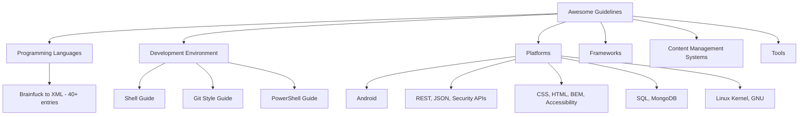

# Awesome Guidelines: Comprehensive Repository Analysis

An in-depth analysis of the [Kristories/awesome-guidelines](https://github.com/Kristories/awesome-guidelines) repository, a curated list of programming style guides, best practices, and coding conventions. This report maps the repository's structure into functional domains (Frontend, Backend, Databases, Infrastructure, API, Tools), provides deep-dives into key guidelines, and summarizes the top recommended resources.

---

## ️ Repository Structure Mapping

The repository acts as a directory of links organized by general programming topics:


To make this catalog actionable for engineering teams, we can re-map the resources into **industry-standard software engineering domains**:

### 1. Naming Conventions & Code Style
*   **CamelCase / PascalCase**: Common in `.NET` naming guidelines, C# conventions, Java standard style.
*   **snake_case**: Recommended by the *SQL Style Guide*, *PEP 8 (Python)*, and *Effective Go* (for package names, lowercase is preferred; for identifiers, mixedCaps).
*   **kebab-case**: Heavily leveraged in frontend guidelines for CSS/HTML selectors and *BEM (Block Element Modifier)* naming.

### 2. Design Patterns & Principles
*   **Clean Code Adaptations**:
    *   *Clean Code JavaScript* (Robert C. Martin's principles tailored for JS).
    *   *Clean Code PHP* (SOLID principles, clean naming, and OOP patterns for modern PHP).
*   **Core Architectural Guides**:
    *   *C++ Core Guidelines*: Focused on type safety, resource management (RAII), and concurrency.
    *   *Go Standard Project Layout*: Structuring enterprise Go applications by isolating `/cmd`, `/internal`, `/pkg`, and `/api`.

### 3. Frontend Development
*   **Styling Standards**:
    *   *CSS Guidelines (Harry Roberts)*: Architectural guidelines for writing scalable, manageable CSS (e.g., specificity control, layout patterns).
    *   *Airbnb CSS / Sass*: Practical style and formatting conventions.
    *   *BEM Methodology*: Structured class naming to avoid CSS style leaking.
*   **Usability & Standards**:
    *   *Web Content Accessibility Guidelines (WCAG) 2.1*: Ensuring web products are perceivable, operable, understandable, and robust.
    *   *Front-End Checklist*: A pre-launch validation guide for performance, SEO, accessibility, and security.

### 4. Backend Development & Languages
*   **Python**: PEP 8 (standard formatting) and Google Python Style Guide (restrictions on language features).
*   **Go**: *Effective Go* (idiomatic code structure) and *Uber Go Style Guide* (performance, testing, and practical patterns).
*   **Rust**: *Rust API Guidelines* (designing safe, predictable, and idiomatic Rust crates).
*   **Java**: *Google Java Style* and Oracle's historical conventions.

### 5. Databases & Storage
*   **SQL Style Guide**: Formatting rules for queries (capitalized keywords, explicit joins, table aliasing) and database schema naming conventions.
*   **Mongo Style Guide**: Document schema design patterns and naming conventions for collections.

### 6. APIs, Platforms & Infrastructure
*   **API Design**:
    *   *Microsoft REST API Guidelines*: Extremely detailed specifications for HTTP method usage, versioning strategies, long-running processes, and error representations.
    *   *Google Cloud API Design Guide*: Structure, naming, and resource patterns for gRPC and RESTful networked APIs.
    *   *API Security Checklist*: Defense-in-depth cheat sheet for endpoints, auth, headers, and rate limiting.
*   **Development & Git**:
    *   *Git Style Guide*: Clean commit messages, branch naming, and merge workflows.
    *   *Keep a CHANGELOG*: Human-readable guidelines for formatting project history.
    *   *Semantic Versioning (SemVer)*: Standardized version numbers (`MAJOR.MINOR.PATCH`).

---

##  Key Guidelines Deep-Dives

Below are summaries of the core tenets of the most popular and impactful guidelines listed in the repository.

### 1. Python PEP 8 (Official Style Guide)
PEP 8 is the industry standard for writing readable Python code.
*   **Indentation**: Always use 4 spaces per indentation level. Never mix tabs and spaces.
*   **Line Length**: Limit all lines to a maximum of 79 characters (72 for docstrings/comments).
*   **Naming Conventions**:
    *   *Functions & Variables*: `snake_case`.
    *   *Classes*: `PascalCase`.
    *   *Constants*: `UPPERCASE_WITH_UNDERSCORES`.
    *   *Protected/Private Instance Variables*: Lead with a single underscore `_var` or double underscores `__var` (triggers name mangling).
*   **Programming Recommendations**:
    *   Use `is` or `is not` when comparing to singletons like `None` (do not use `==`).
    *   Use `isinstance(obj, Class)` instead of checking types directly.

> [!TIP]
> Use tools like `black` or `flake8` to automatically format and lint Python code according to PEP 8.

---

### 2. JavaScript: Airbnb Style Guide
One of the most popular community-driven standards for modern JavaScript and React.
*   **Variables**: Use `const` for all references; avoid `var`. Use `let` only if you must reassign a variable.
*   **Objects & Arrays**: Use literal syntax for creation (`const item = {}`). Do not use reserved words as keys.
*   **Functions**: Use named function expressions instead of function declarations. Use arrow functions for callbacks.
*   **Formatting**: Use 2 spaces for indentation. Semicolons are mandatory to prevent automatic semicolon insertion (ASI) issues.
*   **Destructuring**: Prefer destructuring when accessing and using multiple properties of an object or array.

---

### 3. Go: Effective Go & Uber Go Style
Go focuses on simplicity, readability, and explicit design.
*   **Formatting**: Handled entirely by `gofmt`. Tab indentations are standard.
*   **Naming**:
    *   Use `MixedCaps` or `mixedCaps` instead of underscores.
    *   Acronyms (API, URL, XML) should keep their case consistent (e.g., `apiServer`, not `api_server` or `ApiServer`).
    *   Interface names should be suffixed with "er" if they contain a single method (e.g., `Reader`, `Writer`).
*   **Error Handling**:
    *   Errors are values returned explicitly, not exceptions.
    *   Handle errors immediately and return early (reduces indentation nesting).
*   **Uber-specific Guidelines**:
    *   Prefer `table-driven tests` for testing complex logic.
    *   Avoid using `panic` in production code. Use error returns instead.
    *   Keep constructors simple; avoid performing side-effects in `New` functions.

---

### 4. APIs: Microsoft REST API Guidelines
These guidelines provide a highly practical roadmap for standardizing enterprise RESTful APIs.
*   **HTTP Verbs**:
    *   `GET`: Retrieve resources. Must be idempotent and safe.
    *   `PUT`: Replace a resource, or create it if the client defines the ID. Must be idempotent.
    *   `PATCH`: Partial update.
    *   `POST`: Create a resource where the server defines the ID, or trigger non-standard actions.
*   **Collections**:
    *   Filtering: Use query parameters (e.g., `$filter=name eq 'John'`).
    *   Pagination: Use client-controlled pagination with `$top` and `$skip`, or server-controlled pagination with `nextLink` tokens.
*   **Asynchronous Operations**:
    *   If a request takes too long, return `202 Accepted` with a `Location` header pointing to a status endpoint where the client can poll the progress.
*   **Versioning**:
    *   Highly recommends versioning via the URL path (e.g., `/v1/users`) or via custom HTTP media types in the `Accept` header.

> [!IMPORTANT]
> The **API Security Checklist** included in the Platforms section reminds developers to always use HTTPS, set secure headers (`X-Content-Type-Options`, `Strict-Transport-Security`), rate limit endpoints (to prevent DDoS/brute force), and validate all inputs.

---

### 5. SQL: SQL Style Guide (Simon Holywell)
Ensures database queries remain readable as schemas grow.
*   **Keywords**: Write all SQL keywords in UPPERCASE (e.g., `SELECT`, `FROM`, `WHERE`, `JOIN`).
*   **Identifiers**: Write table names and columns in lowercase `snake_case`.
*   **Explicit Joins**: Avoid implicit joins in the `WHERE` clause. Always use explicit `INNER JOIN`, `LEFT JOIN`, etc.
*   **AS Keyword**: Always use `AS` when aliasing tables or columns for clarity.
*   **Formatting**: Start new clauses on new lines aligned to the left of the query.

```sql
-- Good Formatting Example
SELECT
    user_id,
    SUM(amount) AS total_spent
FROM
    payments AS p
INNER JOIN
    users AS u ON p.user_id = u.id
WHERE
    p.status = 'completed'
GROUP BY
    user_id;
```

---

##  Top Recommended Resources Summary

The table below highlights the absolute "must-read" guidelines from the repository, based on industry adoption and comprehensive coverage:

| Category | Resource | Why It is Essential | Key Takeaway |
| :--- | :--- | :--- | :--- |
| **Backend** | [Effective Go](https://go.dev/doc/effective_go) | The definitive guide to writing idiomatic Go code. | Simplifies code by explaining compiler behaviors and package design. |
| **Backend** | [PEP 8 - Python](https://peps.python.org/pep-0008/) | The blueprint for Python code across the entire ecosystem. | Readability is the core value; code is read more often than it is written. |
| **Frontend** | [CSS Guidelines](https://cssguidelin.es) | Addresses CSS scalability issues for large applications. | Avoid high specificity and use structured methodologies (like BEM). |
| **Frontend** | [Front-End Checklist](https://github.com/thedaviddias/Front-End-Checklist) | A complete quality-assurance directory for web apps. | Covers metadata, accessibility, performance, security, and SEO. |
| **APIs** | [Microsoft REST API Guidelines](https://github.com/Microsoft/api-guidelines) | One of the most exhaustive REST API design systems in the world. | Details error schemas, pagination, and long-running operations. |
| **APIs** | [API Security Checklist](https://github.com/shieldfy/API-Security-Checklist) | A critical security checklist for web services. | Restricting methods, sanitizing input, and implementing JWT security. |
| **Other** | [Keep a CHANGELOG](http://keepachangelog.com/en/0.3.0/) | Focuses on communication and version tracking. | Changelogs are for humans, not computers. Don't dump raw git logs. |
| **Other** | [Clean Code JavaScript](https://github.com/ryanmcdermott/clean-code-javascript) | Translates general OOP design patterns to JS. | Learn SOLID principles, DRY, and refactoring techniques. |

---

## ️ Recommended Linting & Formatting Stack

To enforce these guidelines automatically, the repository lists several excellent tools. A recommended setup for modern projects includes:

1.  **JavaScript / TypeScript**: [ESLint](https://eslint.org/) (for style/lint rules) + **Prettier** (for auto-formatting).
2.  **Shell Scripts**: [ShellCheck](https://github.com/koalaman/shellcheck) (identifies bugs and code smells in bash scripts).
3.  **Ruby**: [RuboCop](https://rubocop.org) (auto-corrects Ruby styling according to the community style guide).
4.  **PHP**: [Laravel Pint](https://laravel.com/docs/11.x/pint) or **PHP_CodeSniffer** (standardizes spacing and syntax).
5.  **Java**: [Checkstyle](https://github.com/checkstyle/checkstyle) (verifies Java code style).
