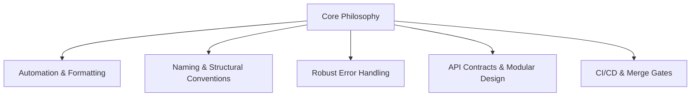

# Unified Coding Standards & Best Practices Synthesis

This synthesis compiles and correlates the key standards, architectural principles, and quality policies extracted from three core resources:
1. **[Google Style Guides](file:///root/.gemini/antigravity-cli/brain/9fc022bf-e645-413d-ad6a-76112d119431/google_styleguide_analysis.md):** Idiomatic language-level practices.
2. **[Augment Code Enterprise Standards](file:///root/.gemini/antigravity-cli/brain/9fc022bf-e645-413d-ad6a-76112d119431/augment_standards_analysis.md):** Development organization governance and policies.
3. **[Awesome Guidelines Repo Index](file:///root/.gemini/antigravity-cli/brain/9fc022bf-e645-413d-ad6a-76112d119431/awesome_guidelines_analysis.md):** Multi-domain curated community standards.

---

## 1. Executive Summary & Core Commonalities

All three sources establish that **readability and predictability** are the primary goals of coding standards. Cognitive overhead slows down teams. By formalizing naming, directory structures, and error handling, development organizations can prevent redundant code and speed up debugging.



---

## 2. Shared Principles Across Domains

### A. Formatting & Automation (Shift Left)
*   **The Rules:** Tabs are strictly forbidden. The standard is 2 spaces (Java, JavaScript, C++, Shell, HTML/CSS) or 4 spaces (Python). Line lengths are capped at 80 characters (Python, JavaScript, Shell, C++) or 100 characters (Java).
*   **Enforcement:** Do not debate formatting in code reviews. Organizations must enforce these rules automatically using tooling (such as `Prettier` for JS/TS, `Black` for Python, `gofmt` for Go, and `Checkstyle` for Java).

### B. Naming Conventions & Scope Clarity
A name should instantly signal what an entity is (a class, local variable, constant, or private member).
*   **CamelCase / PascalCase:** Class names, type names, and interface names.
*   **camelCase:** Methods and variables in Java, JavaScript, and TypeScript.
*   **snake_case:** All functions, methods, and variables in Python and C++; SQL table/column names; and database schema identifiers.
*   **kebab-case (hyphen-separated):** HTML/CSS class selectors, BEM style notation, and HTML ID attributes.
*   **Scope Protection:** Trailing underscores (C++ class members like `data_member_`), leading underscores (Python protected members `_member`), or the `local` keyword in Bash protect variables from leaking into global scopes.

### C. Formalized Error & Exception Handling
*   **No Silent Failures:** Java guidelines state catching an exception without logging or rethrowing it is a code smell. If ignored, the variable must be named `unused` or `_` and documented with a comment.
*   **Strict Safety Bounds:** C++ strictly bans standard exceptions, replacing them with explicit `absl::Status` and `absl::StatusOr<T>` error-propagation objects to maintain control flow predictability.
*   **Centralized Logging:** Enterprise standards mandate mapping domain-specific exceptions to centralized monitoring/logging structures to improve MTTR (Mean Time to Resolution).

### D. Imports & Dependency Management
*   **No Wildcards:** Java projects forbid wildcard imports (e.g., `import java.util.*;`). Every dependency must be explicit.
*   **Absolute Paths:** Python mandates absolute imports (e.g., `from app.models import User`) to prevent search path confusion.
*   **Direct Inclusions:** C++ enforces "Include What You Use" (IWYU). If you reference a type directly, include its header directly rather than relying on transitive headers.

---

## 3. The Enterprise Quality Loop (Governance)

Coding standards do not start and end at the editor. To prevent software quality from decaying under feature velocity pressures, enterprise developers must implement the following gates:

```
  Git Hygiene (Conventional Commits)
                 │
                 ▼
  Automated Checkpoints (Linters, Security Scans, Coverage Gates)
                 │
                 ▼
  Structured Code Review (Focus on logic, system design, performance)
                 │
                 ▼
  Technical Debt Budgets (Continuous refactoring sprints)
```

1.  **Conventional Commits & SemVer:** Branch naming conventions and Conventional Commits (`feat(auth): ...`, `fix(payment): ...`) are linked to task numbers, allowing release pipelines to automatically generate changelogs and perform semantic version updates.
2.  **Linting & Merge Gates:** Deploy lint-check gates (like `ESLint` or `ShellCheck`) and unit test coverage thresholds directly within the CI/CD pipeline. No human reviewer should check formatting or basic test pass rates.
3.  **Refactoring Budgets:** Allocate a fixed percentage of each sprint (usually 10-20%) as a refactoring budget to tackle technical debt systematically before it slows down feature delivery.

---

## 4. Recommended Stack & Standards Directory

When setting up new service repositories, organizations should align on the following directory mapping and toolchain:

| Domain | Language / Spec | Primary Style Guide | Linters & Formatters |
| :--- | :--- | :--- | :--- |
| **Backend** | Python | PEP 8 / Google Python | `Black` / `flake8` / `ruff` |
| **Backend** | Go | Effective Go / Uber Go Style | `gofmt` / `go vet` / `golangci-lint` |
| **Backend** | Java | Google Java Style | `google-java-format` / `Checkstyle` |
| **Frontend** | JS / TS / React | Airbnb JS / TypeScript Style | `ESLint` / `Prettier` |
| **Database** | SQL | Simon Holywell SQL Guide | `sqlfluff` / capitalized keywords |
| **APIs** | REST / gRPC | Microsoft API / Google Cloud API | OpenAPI Spec Contracts / `spectral` |
| **Infrastructure** | Shell (Bash) | Google Shell Guide | `ShellCheck` *(Requires `local` separation)* |
| **Styling** | CSS / Sass | CSS Guidelines / BEM | `stylelint` / hyphen-separated BEM |
